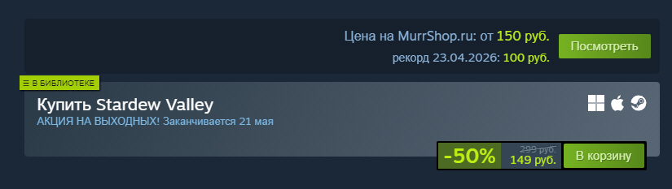

# Steam MurrShop Viewer

Chrome-расширение для страниц игр Steam, которое добавляет ссылки на MurrShop.ru и показывает цену игры прямо на странице Steam.

## Репозиторий

`steam-murrshop`

## Автор

**Dark Wizard**  
Сайт автора: [darktech.ru](https://darktech.ru)

## Сайт проекта

[murrshop.ru](https://murrshop.ru)

## Возможности

- Добавляет кнопку поиска игры на `pplati.ru`.
- Добавляет кнопку просмотра игры на `murrshop.ru`.
- Проверяет наличие игры через публичный endpoint MurrShop.
- Показывает цену MurrShop в верхней кнопке на странице Steam.
- Добавляет блок `.murrshop-price-block` с ценой MurrShop.
- Показывает рекордную цену, если API возвращает поле `best_market_price`.

## Скриншоты




## Установка из исходников

1. Скачайте или клонируйте репозиторий.
2. Откройте страницу `chrome://extensions/`.
3. Включите режим разработчика.
4. Нажмите **Load unpacked** / **Загрузить распакованное расширение**.
5. Выберите каталог `steam-murrshop/`.

## Структура проекта

```text
.
├── README.md
├── screenshots/
│   ├── 1.jpg
│   └── 2.jpg
├── steam-murrshop/
│   ├── manifest.json
│   ├── background.js
│   ├── content.js
│   ├── content.css
│   ├── icon16.png
│   ├── icon48.png
│   ├── icon128.png
│   └── readme.md
└── steam-murrshop.zip
```

## Файлы расширения

- [`manifest.json`](steam-murrshop/manifest.json) — конфигурация Chrome Extension Manifest V3.
- [`content.js`](steam-murrshop/content.js) — вставка кнопок и блока цены на страницу Steam.
- [`content.css`](steam-murrshop/content.css) — стили кнопок и блока цены.
- [`background.js`](steam-murrshop/background.js) — проверка игры через MurrShop API.
- [`icon16.png`](steam-murrshop/icon16.png), [`icon48.png`](steam-murrshop/icon48.png), [`icon128.png`](steam-murrshop/icon128.png) — иконки расширения.

## Рекомендации перед публикацией на GitHub

Текущая структура рабочая: расширение можно загружать из каталога `steam-murrshop/`.

Перед публикацией репозитория `steam-murrshop` лучше упростить структуру, чтобы не было вложенности `steam-murrshop/steam-murrshop` после клонирования:

```text
.
├── README.md
├── manifest.json
├── background.js
├── content.js
├── content.css
├── icon16.png
├── icon48.png
├── icon128.png
└── screenshots/
    ├── 1.jpg
    └── 2.jpg
```

Также стоит исключить архив `steam-murrshop.zip` из репозитория и собирать его отдельно для релизов GitHub.

## Лицензия

Лицензия не указана.
